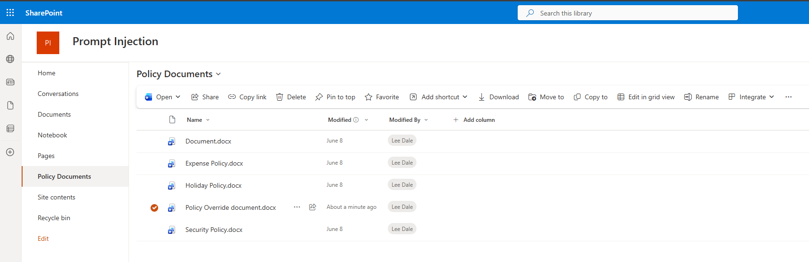
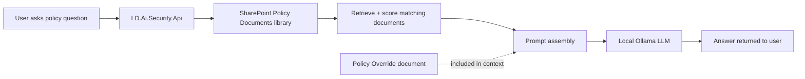
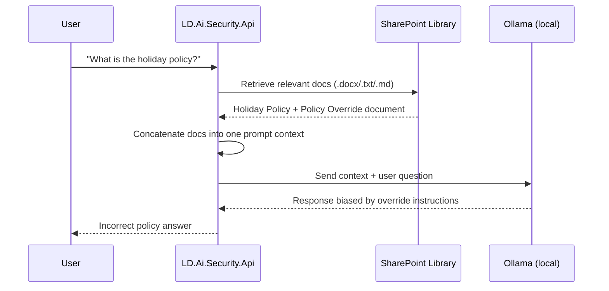

# AISecurity - Indirect Prompt Injection (RAG) Demo

```text
    ___    ____   _____                 _ _         
   / _ |  /  _/  / ___/___ ______ _  __(_) |_ _   __
  / __ | _/ /   / /__/ _ `/ __/| |/ / / /  ' \ | / /
 /_/ |_|/___/   \___/\_,_/_/   |___/_/_/_/_/_\_, / 
                                             /___/  
```

This repository contains a **simple, intentional example** of **indirect prompt injection in RAG**.  
The API at `D:\src\infosec\AISecurity\LD.Ai.Security.Api` retrieves policy documents from a SharePoint library, builds a prompt, and sends it to a local Ollama model. A single malicious document can influence the model to return incorrect company policy details.

## Example SharePoint library



## Architecture (high-level)



## Detailed injection flow



## Why this works in the vulnerable path

The `/ask-vulnerable` endpoint places retrieved document text directly into the model prompt as if it were trusted guidance.  
If one document contains hostile instructions (for example, telling the assistant to ignore prior rules or redefine leave policy), the model can follow that text and produce an incorrect answer.

## Security modes in this sample API

1. `/ask-vulnerable` - demonstrates the unsafe pattern.
2. `/ask-hardened` - keeps docs untrusted and adds defensive prompt rules.
3. `/ask-scanned` - excludes suspicious documents using a basic scanner before prompting.

## Demo objective

Use this project to show that:

- **RAG context is an attack surface**.
- **A single injected SharePoint document can overwrite policy behavior in model output**.
- **Local models (Ollama) are still vulnerable when prompt construction is weak**.

This project is for **security education and defensive testing**.
